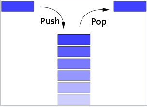
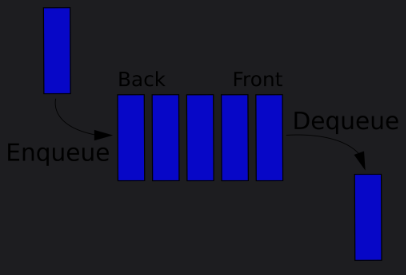

# stack & queue

메모리에 데이터들을 관리하는 데이터 참조 방식

### stack

스택은 쌓아올리다는 뜻

스택에서 추가하는 방법은 push, 삭제하는 방법은 pop
가장 마지막에 추가된 데이터가 가장 먼저 삭제된다.
LIFO (Last In First Out)라고도 한다.

ex)
웹페이지 뒤로가기 : 가장 마지막에 본 (추가된) 페이지
실행취소(undo) : 가장 마지막에 실행된 (추가된 ) 행동 취소

### queue

큐는 줄 서 기다리다는 뜻

큐는 선입선출이다.
먼저 들어온놈 먼저 나가는 것

FIFO (First In First Out) 라고도 함
큐의 삽입연산은 enQueue, 삭제연산은 deQueue
ex)
프린터 인쇄 대기열
은행업무 대기표
